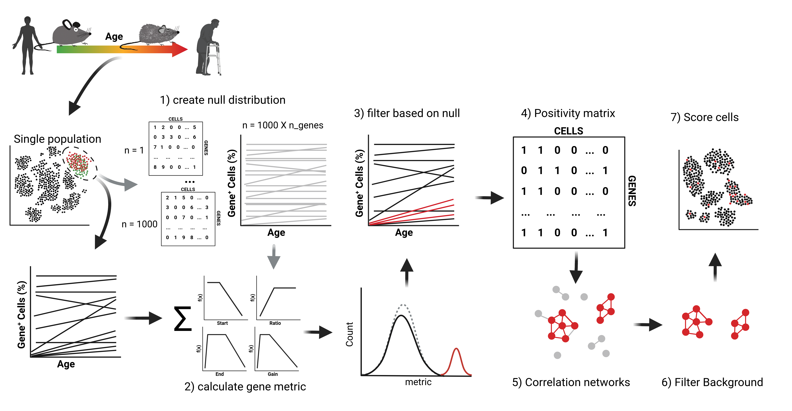

# **cell-type-specific senescence gene sets and single-cell scoring tool**

**senePy** is a database of cell-type-specific gene signatures of cellular senescence packaged with a single-cell scoring tool. Gene signatures can be extracted and used in other analyses or senePy can be used directly to score the senescence state of single-cells based on their gene expression.



Key functionality:
- Database of 75 **mouse** and 65 **human** signatures of cellular senescence from 97 unique cell types
- Score single-cell transcirptomes based on their expression of select senescence signatures
- Merge multiple signatures to make tissue-specific and universal signatures of senescence
- Gene search and enrichment based on input gene list.
- Integrates with AnnData and scanpy

## Installation Instructions

To install senePy, follow these steps:

1. **Install and create Conda environment (optional)**:
    ```sh
    conda create -n senepy python=3.9
    conda activate senepy
    ```
2. **Install via pip**:
    ```sh
    pip install senepy
    ```


## Tutorials

Here are some tutorials to help you get started with senePy:

- [General Usage tutorial](notebooks/EXAMPLE_USAGE.ipynb)

## Functions

Below are the main functions of senePy. Click on each function name to expand and see the details.
<details>
<summary>load_hubs</summary>
Initializes hub object that contains senePy gene signatures and metadata for either Human or Mouse.

    ```python
    import senepy as sp
    hubs = sp.load_hubs(species = 'Mouse')
    ```

**hubs.metadata** is a dataframe of hubs. It contains which tissue and cell type the hub was derived from as well as the hub_num if there were multiple senescence hubs within that cell type.
- size: number of genes in the hub
- n_sen: number of 180 prior "known" senescence markers curated from literature that were found in the hub.
- hyp: enrichment p-value of the "known" and novel hub genes

Example extraction of a gene signature:

    ```python
    extracted_sig = hubs.get_genes(('Lung', 'fibroblast', 1)) #tissue, cell, hub_num
    ```
This returns a list of genes that belong to the Lung-fibroblast-1 hub.

</details>

<details>
<summary>merge_hubs</summary>
Merges multiple signatures into one.

Below we merge the Lung signatures into one new signature. By default, the union of all genes is taken. The respective value for each gene is the number of times that gene is found in the input signatures.

    ```python
    filt_meta = hubs.metadata[hubs.metadata.tissue == 'Lung']
    hubs.merge_hubs(filt_meta, new_name = 'Lung_merged')
    print(hubs.hubs['Lung_merged'])
    ```

We can increase the threshold. For example, if we want to keep signatures that occur at least 2 times. This number will drastically reduce the number of genes in the resulting signature if only merging a handful of input signatures.

    ```python
    hubs.merge_hubs(filt_meta, new_name = 'Lung_merged_min2', overlap_threshold = 2)
    ```

We can also calculate a threshold automatically using a permutation-based method. In the example below, we merge all signatures from all tissues and cells. We then use a 5% random chance threshold and remove all the genes that occur less than that number of times.

    ```python
    hubs.merge_hubs(hubs.metadata, new_name = 'universal', calculate_thresh = True)
    ```

</details>

<details>
<summary>search_hubs_by_genes</summary>
Function to find hubs that contain genes of interest. Returns a dataframe with relevant metadata and statistics.

Example:

    ```python
    hubs.search_hubs_by_genes(['Cdkn2a', 'Cdkn1a', 'Il6', 'Cxcl13'])
    ```

</details>

<details>
<summary>score_hub</summary>
Function to score single-cell transcriptomes based on a given senescence gene signature.

Example scoring and saving as a new column in anndata.obs. With default settings it does not matter if the data are normalized or raw. Just make sure they are not scaled:

    ```python
    adata.obs['sp_score'] = sp.score_hub(adata, hubs.hubs[('Lung', 'fibroblast', 1)])
    ```

score_hub contains multiple options that can affect the scoring method. By default, it weighs the importance of each gene based on the number of connections that gene has in the hub network. By default, it binarizes the data, which makes normalization and transformation optional. We can mimic default scanpy.score_genes by removing both of these parameters:

    ```python
    # make sure anndata is normalized and log transformed
    # import scanpy as sc
    # scanpy.pp.normalize_total(adata)
    # sc.pp.log1p(adata)
    adata.obs['sp_score'] = sp.score_hub(adata, hubs.hubs[('Lung', 'fibroblast', 1)], binarize=False, importance=False)
    ```

</details>


---
